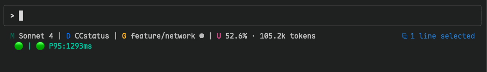
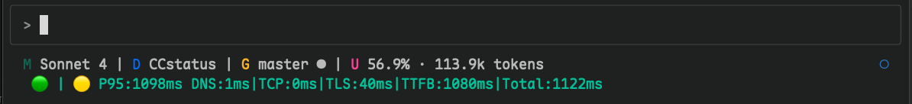

# CCstatus


[English](README_EN.md) | [中文](README.md)

## 初心
- 看了很多 statusline 的项目，都是在界面上做文章，感觉实用性还是有点不够。 
- Anthropic Claude Code 基本是同类最强，但支持地区并不包含中国大陆地区，因此出现了 [CCR](https://github.com/musistudio/claude-code-router), 特别是 [Claude Relay Service](https://github.com/Wei-Shaw/claude-relay-service) 等项目。
- 但随之而来的是各种状况，特别是网络有关的，"用户 -> Anthropic" 之间网络情况复杂，很多时候不知道发生什么问题。
- 因此，开发了这个项目，可以知道 `用户 -> ··· -> CRS -> ··· -> Anthropic` 之间， CRS 是否健康，请求到 Anthropic API 的通讯延迟的情况。

- 已知错误信息
    - [API Error](assets/API-error.png)
    - [API Error](assets/API-error.png)
    - [Error Code](assets/CC-ErrorCode-0.png)


## 功能说明
- 基于 Rust 的高性能 Claude Code 状态栏工具，集成 网络探测、Git 信息和实时使用量跟踪。
- 无后台监控进程，仅依赖 statusline `stdin` 信息驱动，基于 `时间窗口` 设计的 `网络探测`功能。
- 归集工作项目的 JSONL 日志，将`错误`信息统一归集，清楚了解 Claude Code 返回的错误情况。
- 更多关于 `stdin，时间窗口，JSONL` 等重要信息，请查阅：[Q & A](qna-stdin-windows-jsonl.md)

## 注意

### 网络探测 **并非** 监控

- 设计是后台进程来定时探测，所以如果你的 Claude Code 开着，且什么交互，就不会在设计窗口期间刷新网络数据
- 网络状况好坏是动态的（🟢/🟡/🔴），因此使用了 P95 统计值，在归集的 12 个 Total（端到端）数据基础上计算，更多细节自行查阅`ccstatus-monitoring.json`
- 如果降级/出错，会显示详细数据（DNS|TCP|TLC|TTFB），特别是 TTFB，是从 `发出模型服务请求 <--> Anthropic 返回` 第一个字节的时间。
- 这中间是那个关卡的问题，这个工具仅能告诉你信息，你要自己去排查那个环节延迟最大。 

### OAuth Masquerade 支持 ✨ (v2.2.6)
- **OAuth 伪装模式**: 新增完整的 OAuth 环境支持，包含 OAuth 伪装探测系统
  - **第一方请求模拟**: OAuth 令牌通过 Authorization 头部发送到 `https://api.anthropic.com`，伪装为直接客户端请求
  - **绿色状态指示器**: 显示绿色 emoji (🟢) 和时间指标，省略代理健康前缀
  - **令牌过期检查**: 自动检查令牌过期时间，避免无效请求
  - **详细时间分解**: 支持 DNS|TCP|TLS|TTFB 详细计时（需 `timings-curl` 特性）
  - **安全调试日志**: 令牌长度记录而非完整令牌，保护敏感信息
  - **跨平台支持**: 通过 `CLAUDE_CODE_OAUTH_TOKEN` 环境变量和 macOS Keychain
  - **智能渲染**: 格式为 `🟢 P95:...ms DNS:...|TCP:...|TLS:...|Total:... HTTP/x`

### 待改善  
- ✅ ~~OAuth 订阅用户状态显示问题已解决~~ (v2.2.6 修复)
- 其他已知问题: 暂无


## 用户界面

- 常规显示：
- 降级详细信息：


```
模型 | 工作目录 | Git 分支状态 | 上下文窗口 | 网络状态
```

## 特性

- **高性能** Rust 原生速度
- **Git 集成** 显示分支、状态和跟踪信息
- **模型显示** 简化的 Claude 模型名称
- **使用量跟踪** 基于转录文件分析
- **网络探测** 由 Claude Code Statusline 驱动的 Proxy/API 端点状态感知 ⚡
- **尝试减缓** JS Challenge/Bot Fight 挑战 (也不太指望。。。) 🛡️
- **自动更新系统** 内置版本检查和地理路由优化 🔄
  - **手动检查**: `ccstatus --check-update` 命令行工具
  - **状态栏集成**: 后台更新检查，发现新版本时状态栏闪烁提醒
  - **地理路由**: 中国大陆用户自动使用 hk.gh-proxy.com 加速下载
  - **持久化缓存**: ETag/Last-Modified 缓存减少网络请求
- **目录显示** 显示当前工作空间
- **简洁设计** 使用 Nerd Font 图标
- **简单配置** 通过命令行选项配置
- **模块化功能** 可配置构建选项

## 安装与启用

### NPM 安装（推荐）

- 最简单的安装方式是通过 npm：

```bash
npm install -g @mauruppi/ccstatus
```

- 使用镜像源加速下载：
```bash
npm install -g @mauruppi/ccstatus --registry https://registry.npmmirror.com
```

**特性：**
- ✅ **一键安装** 支持所有平台
- ✅ **自动平台检测**（macOS Intel/ARM64、Linux x64、Windows x64）
- ✅ **Claude Code 自动配置**（自动安装到 `~/.claude/ccstatus/`）
- ✅ **静态二进制** 零依赖
- ✅ **简易更新** 通过 `npm update -g @mauruppi/ccstatus`

安装完成后，二进制文件自动配置到 Claude Code，即可使用。

### 手动下载安装（备选）
#### [GitHub Releases](https://github.com/MaurUppi/CCstatus/releases)

<details><summary>各平台部署</summary>
<p>

#### Linux

```bash
mkdir -p ~/.claude/ccstatus
wget https://github.com/MaurUppi/CCstatus/releases/latest/download/ccstatus-linux-x64-static.tar.gz
tar -xzf ccstatus-linux-x64-static.tar.gz
cp ccstatus ~/.claude/ccstatus/CCstatus
chmod +x ~/.claude/ccstatus/CCstatus
```
*系统要求: Ubuntu 22.04+, CentOS 9+, Debian 11+, RHEL 9+ (glibc 2.35+)*

### macOS (Intel)

```bash  
mkdir -p ~/.claude/ccstatus
wget https://github.com/MaurUppi/CCstatus/releases/latest/download/ccstatus-macos-x64-static.tar.gz
tar -xzf ccstatus-macos-x64-static.tar.gz
cp ccstatus ~/.claude/ccstatus/CCstatus
chmod +x ~/.claude/ccstatus/CCstatus
```

### macOS (Apple Silicon)

```bash
mkdir -p ~/.claude/ccstatus  
wget https://github.com/MaurUppi/CCstatus/releases/latest/download/ccstatus-macos-arm64-static.tar.gz
tar -xzf ccstatus-macos-arm64-static.tar.gz
cp ccstatus ~/.claude/ccstatus/CCstatus
chmod +x ~/.claude/ccstatus/CCstatus
```

### Windows

```powershell
# 创建目录并下载
New-Item -ItemType Directory -Force -Path "$env:USERPROFILE\.claude\ccstatus"
Invoke-WebRequest -Uri "https://github.com/MaurUppi/CCstatus/releases/latest/download/ccstatus-windows-x64-static.zip" -OutFile "ccstatus-windows-x64-static.zip"
Expand-Archive -Path "ccstatus-windows-x64-static.zip" -DestinationPath "."
Move-Item "ccstatus.exe" "$env:USERPROFILE\.claude\ccstatus\CCstatus.exe"
```

</p>
</details> 


### Claude Code 启用

**Linux/macOS:** `~/.claude/settings.json`
```json
{
  "statusLine": {
    "type": "command", 
    "command": "~/.claude/ccstatus/CCstatus",
    "padding": 0
  }
}
```

**Windows:** `C:\ProgramData\ClaudeCode\settings.json`
```json
{
  "statusLine": {
    "type": "command", 
    "command": "%USERPROFILE%\\.claude\\ccstatus\\CCstatus.exe",
    "padding": 0
  }
}
```

## 默认显示

### 使用中模型

显示简化的 Claude 模型名称：
- `claude-3-5-sonnet` → `Sonnet 3.5`
- `claude-4-sonnet` → `Sonnet 4`

### 工作目录
- 当前项目目录名称

### Git 状态指示器

- 带 Nerd Font 图标的分支名
- 状态：`✓` 清洁，`●` 有更改，`⚠` 冲突
- 远程跟踪：`↑n` 领先，`↓n` 落后

### 上下文窗口显示

基于转录文件分析的令牌使用百分比，包含上下文限制跟踪。

### 网络探测 ⚡

**实时 Claude API 连接状态监控：**

- 🟢 **健康**: API 响应正常 (P95 < 4s)
- 🟡 **降级**: 响应较慢或频率限制 (P95 4-8s)
- 🔴 **错误**: 连接问题或 API 故障
- ⚪ **未知**: 监控已禁用或无凭据

**智能监控窗口：**

- **COLD**: 启动或会话更改时立即检查
- **GREEN**: 活跃使用期间每 5 分钟定期健康检查
- **RED**: 转录文件显示 API 错误时触发的错误检查

**功能特性：**

- 自动凭据检测（环境变量、shell、Claude 配置）
- **代理健康检查**：独立的代理健康状态监控模块
  - 智能健康状态评估：健康/降级/故障/未知
  - 多 URL 探测策略：主要端点 + 备用端点
  - 官方端点检测，跳过代理检查避免冗余
- **Bot Fight 智能检测**：机器人挑战识别与缓解 🛡️
  - **多维度检测**：HTTP 状态码 (403/429/503) + Cloudflare 头部分析
  - **盾牌状态显示**：Bot 挑战时显示 🛡️ 图标和总响应时间
  - **P95 污染防护**：Bot 挑战响应自动从性能统计中排除
  - **安全时间抑制**：POST Bot 挑战时不显示详细计时分解
  - **HTTP 版本追踪**：记录 HTTP/1.1 vs HTTP/2.0 协议使用情况
- **JSONL 日志增强**：改进错误信息归集和分析能力
- P95 延迟跟踪，滚动 12 样本窗口
- 频率门控探测，最小化 API 使用
- 使用 `CCSTATUS_DEBUG=true` 进行调试日志记录
- 跨会话状态持久化


## 性能

- **启动时间**：< 50ms
- **内存使用**：< 10MB 
- **二进制大小**：3.1 MB 静态构建（包含网络探测）
- **网络开销**：< 1 次 API 调用/5分钟（频率门控）
- **监控延迟**：智能窗口最小化对 Claude API 使用影响

## 系统要求

- **Claude Code**: 用于状态栏集成


## 更新日志

请查看更新日志：[`CHANGELOG.md`](CHANGELOG.md)


<details><summary>从源码构建</summary>
<p>

- 详细构建配置选项请参考 [README.md 的 Build from Source 章节](README.md#build-from-source)
- 自行修改 `cargo.toml`
```bash
git clone https://github.com/MaurUppi/CCstatus.git
cd CCstatus

# 默认构建（基础功能 + 网络探测 + 自动更新）
cargo build --release

# 构建（基础功能 + 网络探测 **分时显示**）
cargo build --release --features timings-curl

# 构建 （全静态库）
cargo build --release --features timings-curl-static

# 仅网络监控（不含更新功能）
cargo build --release --features network-monitoring --no-default-features
```

构建选项：
- **默认**: 基础功能 + 网络探测 + 自动更新 (~4.1MB)
- **仅网络监控**: 基础功能 + 网络探测（不含更新） (~3MB)
- **+ timings-curl**: 高精度分时显示 (~4.3MB)
- **+ timings-curl-static**: 全静态库 (~7MB)

</p>
</details> 


## 贡献

欢迎贡献！请随时提交 issue 或 pull request。

## 感谢

- 本项目基于 Haleclipse 的 [CCometixLine](https://github.com/Haleclipse/CCometixLine) 全面改造

## 许可证

本项目采用 [MIT 许可证](LICENSE)。

