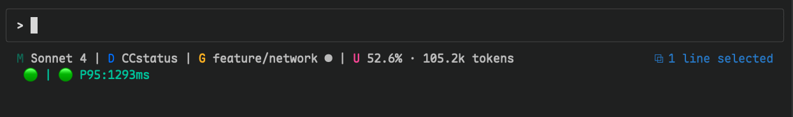

# CCstatus

[English](README.md) | [中文](README.zh.md)

基于 Rust 的高性能 Claude Code 状态栏工具，集成 Git 信息和实时使用量跟踪。


## 截图



状态栏显示：模型 | 目录 | Git 分支状态 | 上下文窗口 | 网络状态

## 特性

- **高性能** Rust 原生速度
- **Git 集成** 显示分支、状态和跟踪信息
- **模型显示** 简化的 Claude 模型名称
- **使用量跟踪** 基于转录文件分析
- **网络监控** 实时 Claude API 连接状态监控 ⚡
- **目录显示** 显示当前工作空间
- **简洁设计** 使用 Nerd Font 图标
- **简单配置** 通过命令行选项配置
- **模块化功能** 可配置构建选项

## 安装

### 快速安装（推荐）

通过 npm 安装（适用于所有平台）：

```bash
# 全局安装
npm install -g @cometix/ccline

# 或使用 yarn
yarn global add @cometix/ccline

# 或使用 pnpm
pnpm add -g @cometix/ccline
```

使用镜像源加速下载：
```bash
npm install -g @cometix/ccline --registry https://registry.npmmirror.com
```

安装后：
- ✅ 全局命令 `ccline` 可在任何地方使用
- ✅ 自动配置 Claude Code 到 `~/.claude/ccline/ccline`
- ✅ 立即可用！

### 更新

```bash
npm update -g @cometix/ccline
```

### 手动安装

或者从 [Releases](https://github.com/MaurUppi/CCstatus/releases) 手动下载：

#### Linux

#### 选项 1: 动态链接版本（推荐）
```bash
mkdir -p ~/.claude/ccline
wget https://github.com/MaurUppi/CCstatus/releases/latest/download/ccline-linux-x64.tar.gz
tar -xzf ccline-linux-x64.tar.gz
cp ccline ~/.claude/ccline/
chmod +x ~/.claude/ccline/ccline
```
*系统要求: Ubuntu 22.04+, CentOS 9+, Debian 11+, RHEL 9+ (glibc 2.35+)*

#### 选项 2: 静态链接版本（通用兼容）
```bash
mkdir -p ~/.claude/ccline
wget https://github.com/MaurUppi/CCstatus/releases/latest/download/ccline-linux-x64-static.tar.gz
tar -xzf ccline-linux-x64-static.tar.gz
cp ccline ~/.claude/ccline/
chmod +x ~/.claude/ccline/ccline
```
*适用于任何 Linux 发行版（静态链接，无依赖）*

### macOS (Intel)

```bash  
mkdir -p ~/.claude/ccline
wget https://github.com/MaurUppi/CCstatus/releases/latest/download/ccline-macos-x64.tar.gz
tar -xzf ccline-macos-x64.tar.gz
cp ccline ~/.claude/ccline/
chmod +x ~/.claude/ccline/ccline
```

### macOS (Apple Silicon)

```bash
mkdir -p ~/.claude/ccline  
wget https://github.com/MaurUppi/CCstatus/releases/latest/download/ccline-macos-arm64.tar.gz
tar -xzf ccline-macos-arm64.tar.gz
cp ccline ~/.claude/ccline/
chmod +x ~/.claude/ccline/ccline
```

### Windows

```powershell
# 创建目录并下载
New-Item -ItemType Directory -Force -Path "$env:USERPROFILE\.claude\ccline"
Invoke-WebRequest -Uri "https://github.com/MaurUppi/CCstatus/releases/latest/download/ccline-windows-x64.zip" -OutFile "ccline-windows-x64.zip"
Expand-Archive -Path "ccline-windows-x64.zip" -DestinationPath "."
Move-Item "ccline.exe" "$env:USERPROFILE\.claude\ccline\"
```

### 从源码构建

```bash
git clone https://github.com/MaurUppi/CCstatus.git
cd CCstatus

# 默认构建（基础功能 + 网络监控）
cargo build --release

# 可选：添加自动更新功能
cargo build --release --features "self-update"

# 可选：添加 TUI 配置界面
cargo build --release --features "tui"

# 完整构建（所有功能）
cargo build --release --features "tui,self-update"

# Linux/macOS
mkdir -p ~/.claude/ccline
cp target/release/ccstatus ~/.claude/ccline/ccline
chmod +x ~/.claude/ccline/ccline

# Windows (PowerShell)
New-Item -ItemType Directory -Force -Path "$env:USERPROFILE\.claude\ccline"
copy target\release\ccstatus.exe "$env:USERPROFILE\.claude\ccline\ccline.exe"
```

**构建选项：**
- **默认**: 基础功能 + 网络监控 (~1.8MB)
- **+ self-update**: 自动更新通知 (~4.1MB)
- **+ tui**: 配置界面 (~2.5MB)
- **完整**: 所有功能 (~4.8MB)

详细构建配置选项请参考 [BUILD-CONFIG.md](BUILD-CONFIG.md)。

### Claude Code 配置

添加到 Claude Code `settings.json`：

**Linux/macOS:**
```json
{
  "statusLine": {
    "type": "command", 
    "command": "~/.claude/ccline/ccline",
    "padding": 0
  }
}
```

**Windows:**
```json
{
  "statusLine": {
    "type": "command", 
    "command": "%USERPROFILE%\\.claude\\ccline\\ccline.exe",
    "padding": 0
  }
}
```

## 使用

```bash
# 基础使用 (显示所有启用的段落)
ccline

# 显示帮助
ccline --help

# 打印默认配置
ccline --print-config

# TUI 配置模式 (计划中)
ccline --configure
```

## 默认段落

显示：`目录 | Git 分支状态 | 模型 | 上下文窗口 | 网络状态`

### Git 状态指示器

- 带 Nerd Font 图标的分支名
- 状态：`✓` 清洁，`●` 有更改，`⚠` 冲突
- 远程跟踪：`↑n` 领先，`↓n` 落后

### 模型显示

显示简化的 Claude 模型名称：
- `claude-3-5-sonnet` → `Sonnet 3.5`
- `claude-4-sonnet` → `Sonnet 4`

### 上下文窗口显示

基于转录文件分析的令牌使用百分比，包含上下文限制跟踪。

### 网络监控 ⚡

**实时 Claude API 连接状态监控：**
- 🟢 **健康**: API 响应正常 (P95 < 4s)
- 🟡 **降级**: 响应较慢或频率限制 (P95 4-8s)
- 🔴 **错误**: 连接问题或 API 故障
- ⚪ **未知**: 监控已禁用或无凭据

**智能监控窗口：**
- **COLD**: 启动或会话更改时立即检查
- **GREEN**: 活跃使用期间每 5 分钟定期健康检查
- **RED**: 转录文件显示 API 错误时触发的错误检查

**功能特性：**
- 自动凭据检测（环境变量、shell、Claude 配置）
- P95 延迟跟踪，滚动 12 样本窗口
- 频率门控探测，最小化 API 使用
- 使用 `CCSTATUS_DEBUG=true` 进行调试日志记录
- 跨会话状态持久化

## 配置

计划在未来版本中支持配置。当前为所有段落使用合理的默认值。

## 性能

- **启动时间**：< 50ms（TypeScript 版本约 200ms）
- **内存使用**：< 10MB（Node.js 工具约 25MB）
- **二进制大小**：1.8MB 默认构建（包含网络监控）
- **网络开销**：< 1 次 API 调用/5分钟（频率门控）
- **监控延迟**：智能窗口最小化对 Claude API 使用影响

## 系统要求

- **Git**: 版本 1.5+ (推荐 Git 2.22+ 以获得更好的分支检测)
- **终端**: 必须支持 Nerd Font 图标正常显示
  - 安装 [Nerd Font](https://www.nerdfonts.com/) 字体
  - 中文用户推荐: [Maple Font](https://github.com/subframe7536/maple-font) (支持中文的 Nerd Font)
  - 在终端中配置使用该字体
- **Claude Code**: 用于状态栏集成

## 开发

```bash
# 构建开发版本
cargo build

# 运行测试
cargo test

# 构建优化版本
cargo build --release
```

## 路线图

- [ ] TOML 配置文件支持
- [ ] TUI 配置界面
- [ ] 自定义主题
- [ ] 插件系统
- [ ] 跨平台二进制文件

## 贡献

欢迎贡献！请随时提交 issue 或 pull request。

## 许可证

本项目采用 [MIT 许可证](LICENSE)。

## Star History

[](https://star-history.com/#MaurUppi/CCstatus&Date)