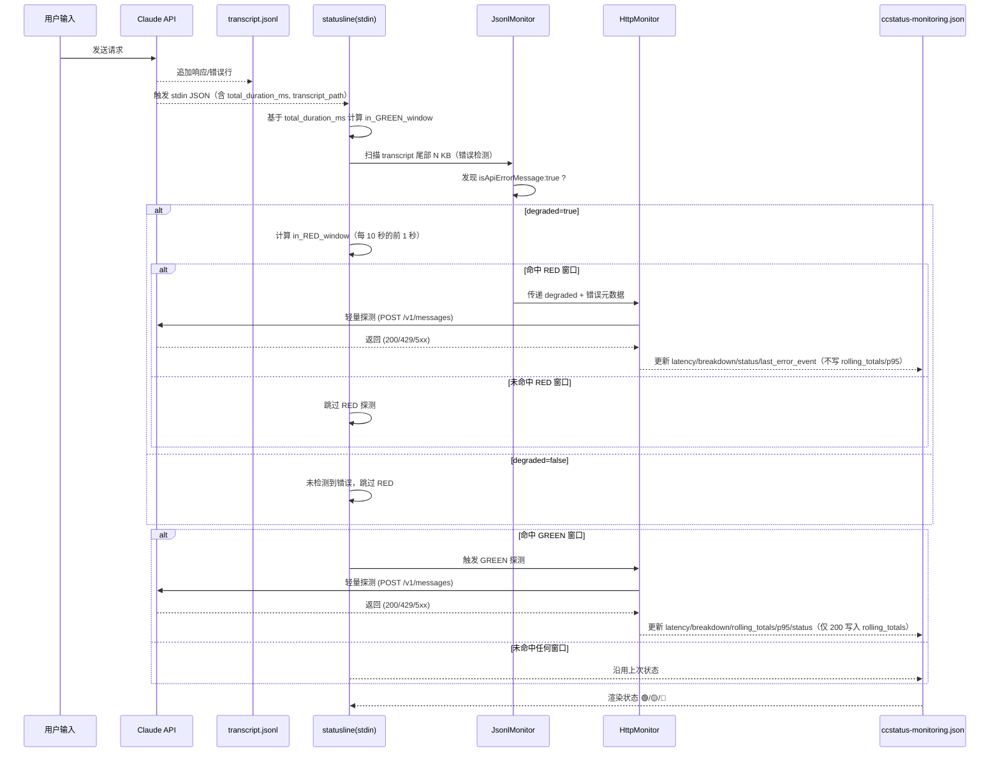
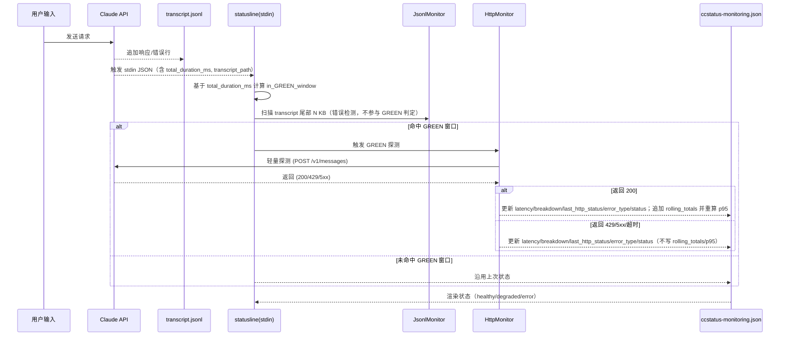
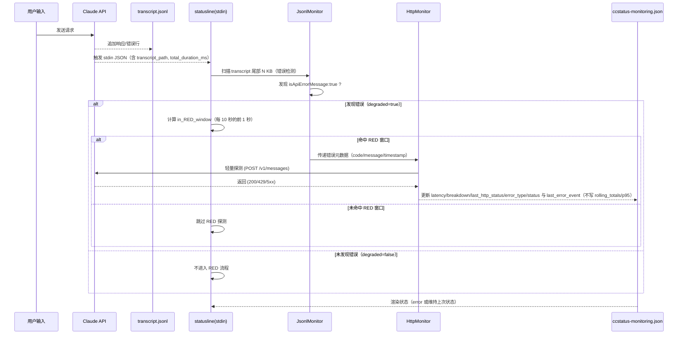

# Network Monitoring Pipeline — Redesign

---

## 🎯 设计目标

* **无后台线程**：完全由 statusline 的 stdin 输入触发。
* **轻量探测**：每次仅在必要时执行一次轻量 POST `/v1/messages`。
* **诊断能力**：输出详细的 `DNS|TCP|TLS|TTFB|Total` 分解时序和错误类型。
* **事件驱动**：通过 transcript 实时写入的 API error 触发 RED 高频检测。
* **趋势可见性**：在 ccstatus-monitoring.json 中维护 Total 延迟的滚动窗口，实时计算 **P95**，用于显示稳定性趋势。

---

## 🔑 输入与触发

* **触发时机**：每次 **Claude API 返回** 后，CLI 会把一次性 payload 通过 **statusline 的 stdin** 传入（包含 `transcript_path`、`cost.total_duration_ms` 等）。
* **statusline stdin JSON**：作为本次渲染/监控的唯一触发源，无需任何后台线程或轮询。
* **transcript\_path**：指向当前 session 的 jsonl 文件，用于错误检测。
* **JsonlMonitor（错误检测）**：每次 stdin 触发时读取 transcript 文件尾部 N KB，检查是否存在 `isApiErrorMessage: true`。仅当检测到错误（degraded=true）时，再进入 **RED（每 10 秒前 1 秒）** 的频率窗口判定；GREEN 巡检不依赖 transcript。

---

## ⚙️ 频率控制

* **GREEN（巡检）**：每 300 秒的前 3 秒窗口。
* **RED（错误追踪）**：每 10 秒的前 1 秒窗口。
* **逻辑**：

  ```pseudo
  if (network_degraded && in_RED_window) || in_GREEN_window:
      trigger_probe_once_per_window()
  ```
* **去重**：通过 `window_id = floor(total_ms / window_size)` 与 `ccstatus-monitoring.json` 的记录避免重复探测。

---

## 📡 探测实现

* **请求**：POST `/v1/messages`，payload 最小化（Haiku + `max_tokens=1`）。
* **超时**：整体 2s，避免 statusline 阻塞。
* **结果分解**：输出 `DNS|TCP|TLS|TTFB|Total`。
* **错误分类**：

  * 401/403 → Authentication
  * 429 → RateLimit
  * 5xx/502/504/529 → ServerError（529 可视为 Overloaded）
  * 超时/连接失败 → Network

POST sample
```
curl -X POST {ANTHROPIC_BASE_URL}/v1/messages \
  -H "Content-Type: application/json" \
  -H "x-api-key: {ANTHROPIC_AUTH_TOKEN}" \
  -d '{
    "model": "claude-3-haiku-20240307",
    "max_tokens": 1,
    "messages": [
      {"role": "user", "content": "Hi"}
    ]
  }'
```

RESPONES sample
```
{"id":"msg_014aLUQSouuj3wj2qP3ThkWw","type":"message","role":"assistant","model":"claude-3-haiku-20240307","content":[{"type":"text","text":"Hello"}],"stop_reason":"max_tokens","stop_sequence":null,"usage":{"input_tokens":22,"cache_creation_input_tokens":0,"cache_read_input_tokens":0,"cache_creation":{"ephemeral_5m_input_tokens":0,"ephemeral_1h_input_tokens":0},"output_tokens":1,"service_tier":"standard"}}%
```
---

## 📂 状态存储（ccstatus-monitoring.json）

示例扩展 schema：

```json
{
  "status": "healthy",
  "monitoring_enabled": true,
  "api_config": {
    "endpoint": "{ANTHROPIC_BASE_URL}/v1/messages",
    "source": "environment"
  },
  "network": {
    "latency_ms": 2650,
    "breakdown": "DNS:20ms|TCP:30ms|TLS:40ms|TTFB:1324ms|Total:2650ms",
    "last_http_status": 200,
    "error_type": null,
    "rolling_totals": [300, 280, 2650, 420, 500],
    "p95_latency_ms": 1200
  },
  "monitoring_state": {
    "last_green_window_id": 123,
    "last_red_window_id": 456,
    "state": "healthy"  
  },
  "last_jsonl_error_event": {
    "timestamp": "2025-08-21T15:17:29.521Z",
    "code": 529,
    "message": "Overloaded"
  },
  "timestamp": "2025-08-21T13:45:19.586212+08:00"
}
```

### 滚动 P95（仅 GREEN 采样）

为保持简单且避免 RED 高频期样本偏置，P95 仅从 GREEN 巡检样本计算：

* **写入时机**：仅在 GREEN 探测成功（HTTP 200/429/5xx/超时均可立即渲染，但仅 200 成功计入样本）时，将本次 `Total latency` 追加到 `rolling_totals`。
* **固定窗口容量（MAX_LEN）**：当 GREEN 窗口为每 300 秒一次时，设定 `MAX_LEN = 12`（覆盖最近约 60 分钟的基线趋势）。如调整 GREEN 频率，可按“期望分钟数 × 每分钟采样次数”重算 MAX_LEN。
* **P95 计算**：每次写入后，从 `rolling_totals` 计算 95 分位写入 `p95_latency_ms`。
* **错误样本处理**：429/5xx/超时仅用于“本次渲染颜色判定”，不写入 `rolling_totals`。

伪代码：

```
if is_green_window and probe_succeeded_with_http_200:
  rolling_totals.push(total_latency_ms)
  trim_to_N(rolling_totals, MAX_LEN)   // MAX_LEN = 12 （≈60 分钟）
  p95_latency_ms = percentile(rolling_totals, 0.95)
```

---

## 🎨 渲染逻辑与状态机（自适应阈值，源自 GREEN-only 样本）

在线阈值来自 `rolling_totals` 的分位数（每次 GREEN 成功探测更新），并写入 `status`：

* 🟢 **正常**：HTTP 200 且 `Total ≤ P80(rolling_totals)` → 绿点 + P95 值。
* 🟡 **退化**：
  * HTTP 200 且 `P80 < Total ≤ P95`，或
  * HTTP 429（速率限制）
  → 黄点 + 分解时序。
* 🔴 **错误**：
  * HTTP 4xx/5xx（除 429）、超时/连接失败，或
  * HTTP 200 但 `Total > P95`
  → 红点 + 分解时序。
* ⚪ **unconfigured**：尚未有检测结果


### 渲染效果示例

* 🟢（示例）healthy

  ```
  🟢 P95=450ms
  ```
* 🟡（示例）degraded

  ```
  🟡 DNS:reuse|TCP:reuse|TLS:reuse|TTFB:890ms|Total:890ms
  ```
* 🔴（示例）error

  ```
  🔴 DNS:12ms|TCP:28ms|TLS:45ms|TTFB:- |Total:2000ms
  ```

---

## 📊 统一时序图（RED/GREEN 条件分支）



### 巡检（GREEN）时序图（仅 GREEN 样本写 P95）



### 异常（RED）时序图（错误驱动 + 频率门控）



---

## ✅ 总结

* `transcript_path` 让我们总是聚焦当前 session 文件 → JsonlMonitor 不需要偏移量。
* Statusline 驱动，JsonlMonitor 读取尾部即可捕获实时 API error。
* API error 触发 RED 高频探测，HttpMonitor 执行轻量请求并更新状态。
* `ccstatus-monitoring.json` 仅基于 GREEN 巡检样本记录最近 N 次 Total → 实时计算 P95，增强趋势可视化。
* 最终渲染既包含单次诊断，也包含滚动稳定性趋势。

# statusline

## Ref: "https://docs.anthropic.com/en/docs/claude-code/statusline"
## How statusline Works
- The status line is updated when the conversation messages update
- Updates run at most every 300ms
- The first line of stdout from your command becomes the status line text
- ANSI color codes are supported for styling your status line
- Claude Code passes contextual information about the current session (model, directories, etc.) as JSON to your script via stdin
- statusLine from my shell PS1 configuration

## How to config statusline
- `.claude/settings.json`
```
{
  "statusLine": {
    "type": "command",
    "command": "~/.claude/statusline.sh", // Your script or binary. 
    "padding": 0 // Optional: set to 0 to let status line go to edge
  }
}
```

## StdIN Input JSON Structure example
```
{
  "session_id": "772eaf12-e929-4d87-abdb-f3ad9669c4d0",
  "transcript_path": "/Users/ouzy/.claude/projects/-Users-ouzy-Documents-DevProjects-CCstatus/772eaf12-e929-4d87-abdb-f3ad9669c4d0.jsonl",
  "cwd": "/Users/ouzy/Documents/DevProjects/CCstatus",
  "model": {
    "id": "claude-sonnet-4-20250514",
    "display_name": "Sonnet 4"
  },
  "workspace": {
    "current_dir": "/Users/ouzy/Documents/DevProjects/CCstatus",
    "project_dir": "/Users/ouzy/Documents/DevProjects/CCstatus"
  },
  "version": "1.0.88",
  "output_style": {
    "name": "default"
  },
  "cost": {
    "total_cost_usd": 0.0009232000000000001,
    "total_duration_ms": 54146,
    "total_api_duration_ms": 2024,
    "total_lines_added": 0,
    "total_lines_removed": 0
  },
  "exceeds_200k_tokens": false
}

```

说明：

* 上述 stdin JSON 是本系统的唯一触发输入；无后台线程或轮询。
* 本次调用内，首先按是否命中 GREEN/RED 窗口进行判定；若判定 RED，则会读取 `transcript_path` 触发 JsonlMonitor 检测。
* JsonlMonitor 只读取 transcript 并产生 `degraded` 信号（以及可选错误元数据），随后由 HttpMonitor 统一执行探测与状态写入。

# Jsonl transcript ERROR JSON example
```
{
"parentUuid": "d4b75640-9df9-4caf-98b9-d8591b1f9983",
"isSidechain": false,
"userType": "external",
"cwd": "/Users/ouzy/Documents/DevProjects/CCstatus",
"sessionId": "ae3a3af0-40d7-47e8-915b-d22b65710147",
"version": "1.0.86",
"gitBranch": "feature/network-monitoring",
"type": "assistant",
"uuid": "8bd1ad3f-1a5e-42d9-a89f-5f3be3b58128",
"timestamp": "2025-08-21T15:17:29.521Z",
"message": {
  "id": "d31d058a-0d24-4c88-b760-b028e560e904",
  "model": "<synthetic>",
  "role": "assistant",
  "stop_reason": "stop_sequence",
  "stop_sequence": "",
  "type": "message",
  "usage": {
    "input_tokens": 0,
    "output_tokens": 0,
    "cache_creation_input_tokens": 0,
    "cache_read_input_tokens": 0,
    "server_tool_use": {
      "web_search_requests": 0
    },
    "service_tier": null
  },
  "content": [
    {
      "type": "text",
      "text": "API Error: 529 {\"type\":\"error\",\"error\":{\"type\":\"overloaded_error\",\"message\":\"Overloaded\"},\"request_id\":null}"
    }
  ]
},
"isApiErrorMessage": true
}
```

说明：

* JsonlMonitor 每次仅读取 transcript 尾部 N KB，查找 `isApiErrorMessage: true`。
* 一旦命中，JsonlMonitor 输出 `degraded=true`（以及可选的 `code/message/timestamp` 元数据）传递给 HttpMonitor。
* HttpMonitor 执行一次轻量探测并统一写入状态文件，包括即时字段（如 `network.latency_ms/breakdown/last_http_status/error_type/status`）以及 `last_error_event`。
* 为保持简单与一致性：RED 路径不向 `rolling_totals` 写入样本，`p95_latency_ms` 仅由 GREEN 成功样本计算。