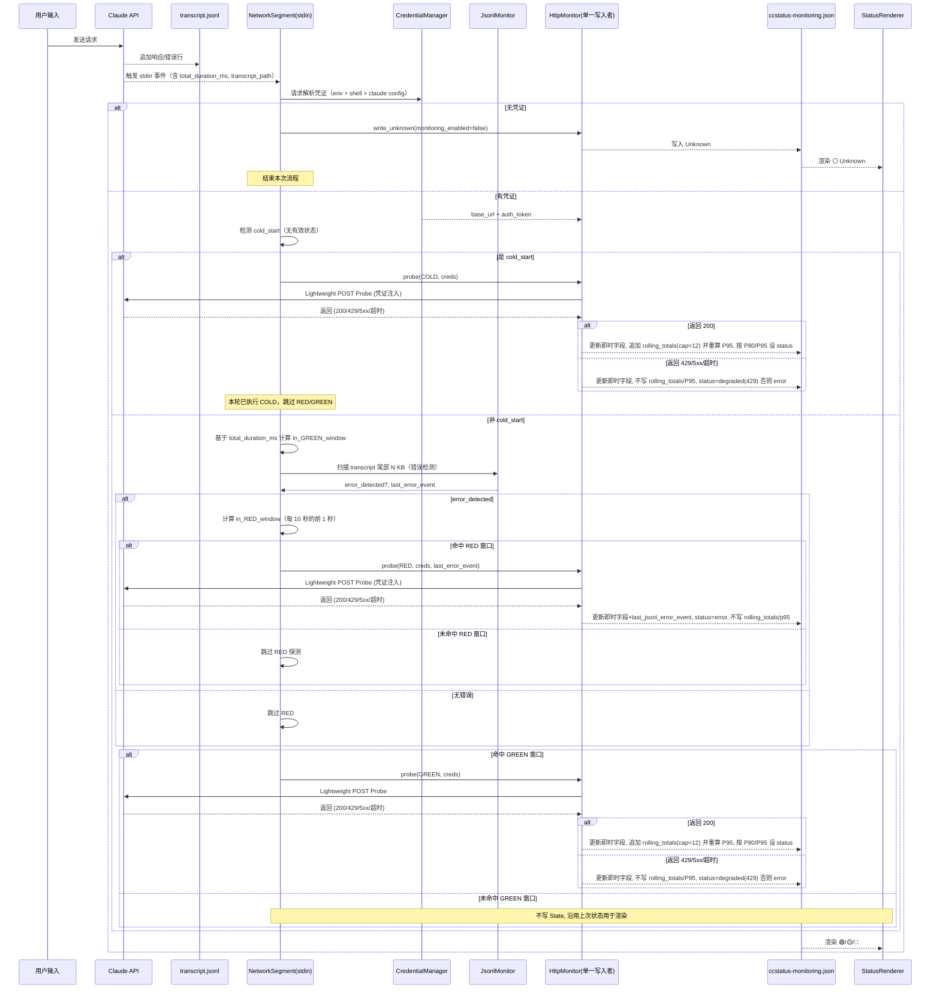
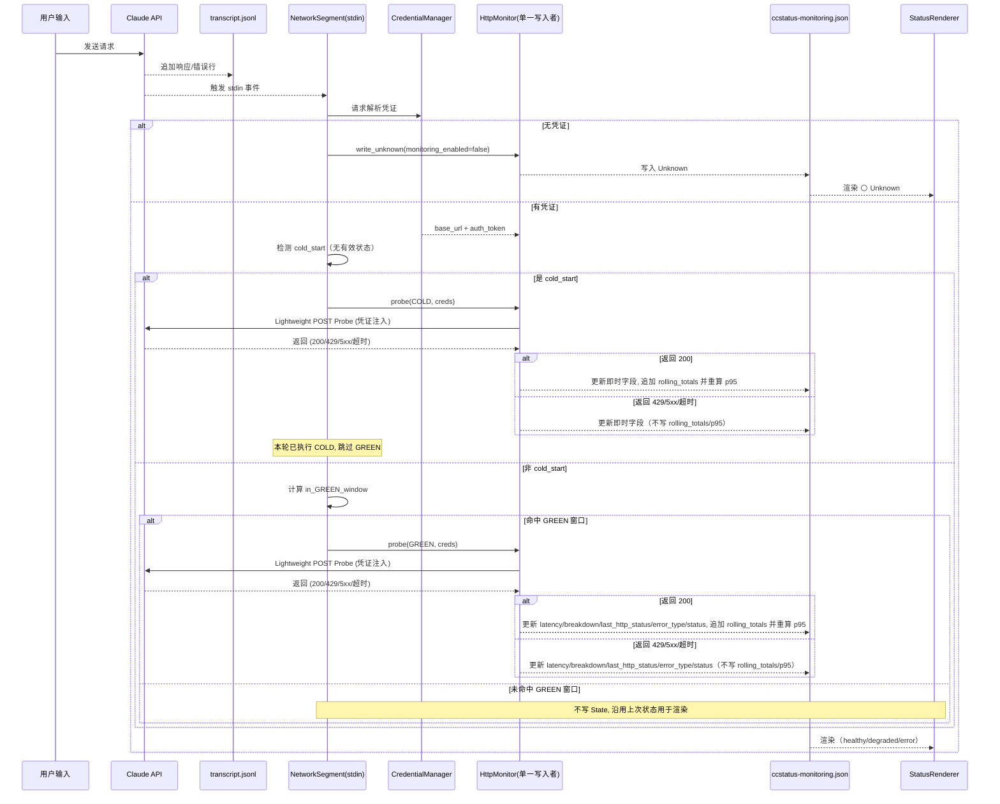
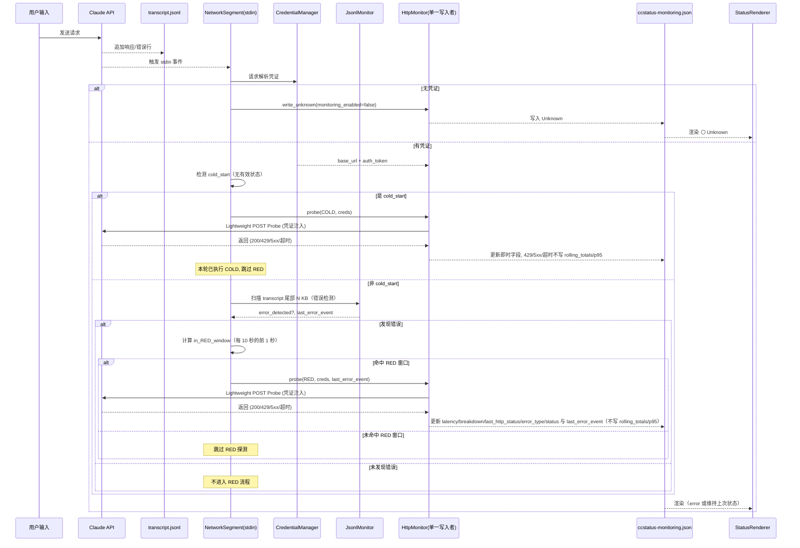
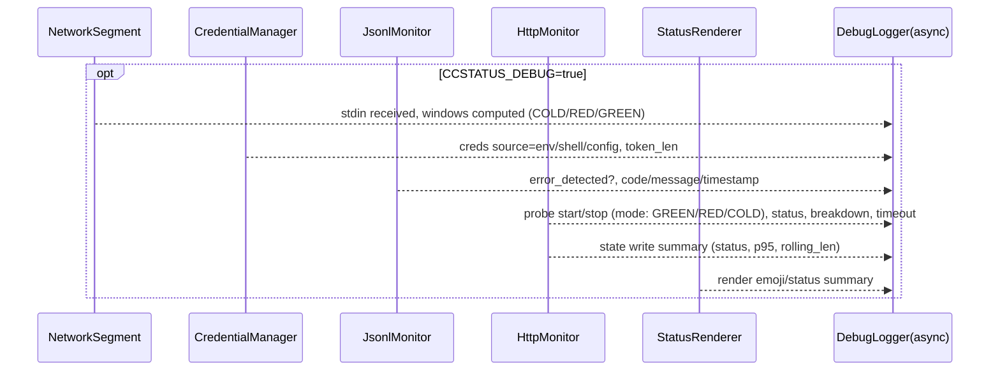
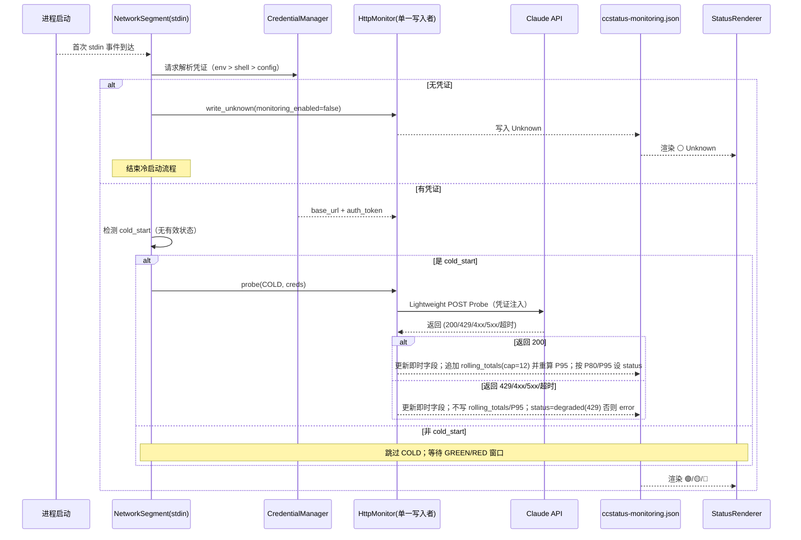

# Network Monitoring Pipeline — v2 (Credential‑enabled, Revised)

## revised date: 2025-08-25 14:00

---

## 🎯 设计目标

- 无后台线程：完全由 statusline 的 stdin 输入触发。
- Lightweight Probe：必要时执行一次轻量 POST `/v1/messages`。
- 诊断能力：输出 `DNS|TCP|TLS|TTFB|Total` 分解时序与错误类型。
- 事件驱动：transcript 中的 API error 触发 RED 高频检测。
- 趋势可见性：`rolling_totals` 计算 P95，用于趋势展示（仅 GREEN 样本）。
- 凭证集成：通过 `CredentialManager` 解析凭证；探测时由 `HttpMonitor` 注入。
- 单一写入者：仅 `HttpMonitor` 负责持久化到 `ccstatus-monitoring.json`；其他模块不写状态。

---

## 🔑 输入与触发

- 触发时机：每次 Claude API 返回后，CLI 将一次性 payload 通过 statusline 的 stdin 传入（含 `transcript_path`、`cost.total_duration_ms` 等）。
- stdin JSON：作为本次渲染/监控的唯一触发源，无后台线程或轮询。
- transcript_path：指向当前 session 的 jsonl，用于错误检测。
- JsonlMonitor（错误检测）：每次 stdin 触发时读取 transcript 尾部 N KB，若检测到 `isApiErrorMessage:true`（degraded=true），再进入 RED（每 10 秒前 1 秒）的频率窗口判定；GREEN 巡检不依赖 transcript。

---

## 🧩 模块职责

### NetworkSegment（stdin orchestration）
- 读取 stdin 输入，解析 `total_duration_ms`、`transcript_path` 等。
- 调用 `CredentialManager` 解析凭证，仅负责编排；不写状态。
- 调用 `JsonlMonitor` 进行错误检测（仅用于 RED 触发门控）。
- 计算 GREEN/RED 频率窗口：
  - GREEN：每 300 秒的前 3 秒
  - RED：每 10 秒的前 1 秒（且仅在检测到错误时）
- 计算 COLD 窗口并优先评估：
  - COLD：`total_duration_ms < COLD_WINDOW_MS` 命中即触发一次性探测（默认 `5000ms`；可由 `ccstatus_COLD_WINDOW_MS` 覆盖）
  - 去重与并发：若当前 `session_id` 等于上次冷启动标记或存在进行中探测，则不再发起新的 COLD
- 在命中窗口时调用 `HttpMonitor::probe(mode, creds)`；未命中窗口则不写状态、仅使用上次状态进行渲染。
- 调用 `StatusRenderer` 输出状态文本。

#### NetworkSegment 集成契约（调用与协调）
- 输入（每次 stdin 事件）：`total_duration_ms`, `transcript_path`, `session_id`。
- 调用次序与参数：
  1) `CredentialManager::get_credentials()` → `Option<ApiCredentials>`（无缓存、每次解析）
  2) 无凭证 → `HttpMonitor::write_unknown(monitoring_enabled=false)`；随后渲染并结束
  3) 非冷启动：`(error_detected, last_error_event) = JsonlMonitor::scan_tail(transcript_path)`
  4) 命中 COLD 优先：`HttpMonitor::probe(COLD, creds, None)`（本轮跳过 RED/GREEN）
  5) 命中 RED 窗口且 `error_detected`：`HttpMonitor::probe(RED, creds, Some(last_error_event))`
  6) 命中 GREEN 窗口：`HttpMonitor::probe(GREEN, creds, None)`
  7) 渲染：读取上次状态并 `StatusRenderer` 输出单行状态
- 去重与并发：
  - COLD：通过 `monitoring_state.last_cold_session_id` 与 `last_cold_probe_at` 去重；同一 `session_id` 本会话仅一次
  - 单次 stdin 内只触发至多一次 `probe`（COLD > RED > GREEN 优先级）
  - 不引入后台线程；所有调用均为同步链路上的“即发即收”

### CredentialManager（凭证解析）
- 解析优先级（三层）：
  - 环境变量：`ANTHROPIC_BASE_URL` + `ANTHROPIC_AUTH_TOKEN`（最高优先级）
  - Shell 配置：解析 `.zshrc/.bashrc` 导出与函数变量
  - Claude Code 配置：JSON 键值读取
- 使用模式（每次 stdin 触发时解析一次，结果仅在本次流程内使用，无缓存）：
  - 成功：提供 `base_url` 与 `auth_token`，供 `HttpMonitor` 构造请求。
  - 失败（None）：`NetworkSegment` 触发 `HttpMonitor` 将状态写为 `unknown`，并跳过 RED/GREEN 探测；沿用上次 `p95_latency_ms`。
- 持久化注意：凭证来源信息（endpoint/source）由 `HttpMonitor` 写入状态文件的 `api_config` 字段（不是 `CredentialManager` 自行写入）。

### JsonlMonitor（错误检测）
- 每次 stdin（非冷启动时）读取 transcript 尾部 N KB（可由 CCSTATUS_JSONL_TAIL_KB 配置，默认64KB）。
- 检测 `isApiErrorMessage:true` 并输出 `error_detected` 与 `last_error_event`（仅用于 RED 门控与记录）。
- 自身不写状态。

### HttpMonitor（探测 + 单一写入者）
- 轻量 POST `{base_url}/v1/messages`，Header `x-api-key: {auth_token}`，payload 最小（Haiku + `max_tokens=1`）。
- 集成状态管理：`HttpMonitor` 是唯一写者，负责原子写入 `~/.claude/ccstatus/ccstatus-monitoring.json`。
- 接口：`probe(mode, creds)`；以及在无凭证时的 `write_unknown(monitoring_enabled=false)`。
- 超时策略：
  - GREEN：`timeout_ms = clamp(p95_latency_ms + 500, 2500, 4000)`；若 `rolling_totals.len() < 4` 使用 `3500`。
  - RED：固定 `2000`。
  - 环境覆盖：若设置 `ccstatus_TIMEOUT_MS`，两类探测均取 `min(env_value, 6000)`。
- 结果与持久化：
  - 生成 `DNS|TCP|TLS|TTFB|Total` breakdown、HTTP status、`error_type`。
  - GREEN：更新即时字段；若 HTTP 200 则追加 `rolling_totals`（cap=12）并重算 `p95_latency_ms`；按 P80/P95 规则写 `status=healthy/degraded`。
  - RED：更新即时字段与 `last_jsonl_error_event`；写 `status=error`；不更新 `rolling_totals/p95`。
  - 无凭证：直接写 `status=unknown` 与 `monitoring_enabled=false`，并记录 `api_config.source=null`（或省略）。
  - COLD：与 GREEN 相同的分类与写入规则；额外持久化 `monitoring_state.last_cold_session_id` 与 `monitoring_state.last_cold_probe_at`（本地时区）以做去重。

#### HttpMonitor 接口设计（对外 API）
- 构造
  - `new(state_path: Option<PathBuf>) -> Self`
    - 默认 `state_path=$HOME/.claude/ccstatus/ccstatus-monitoring.json`
  - 可选 Builder：`with_http_client(...)`、`with_clock(...)`、`with_timeout_override_ms(u32)`（便于测试注入）
- 核心方法
  - `probe(mode: ProbeMode, creds: ApiCredentials, last_jsonl_error_event: Option<JsonlError>) -> Result<ProbeOutcome, NetworkError>`
    - 仅此方法与 `write_unknown` 会写状态文件（单一写入者）
    - 根据 `mode` 选择超时与写入策略；仅 GREEN(200) 追加滚动样本
  - `write_unknown(monitoring_enabled: bool) -> Result<(), NetworkError>`
    - 直接写入 `status=unknown`，`monitoring_enabled=false` 并填充 `api_config`
  - `load_state() -> Result<MonitoringSnapshot, NetworkError>`（只读辅助，用于渲染/调试）
- 类型
  - `enum ProbeMode { COLD, GREEN, RED }`
  - `struct ApiCredentials { base_url: String, auth_token: String, source: CredentialSource }`
  - `struct JsonlError { timestamp: String, code: u16, message: String }`
  - `struct ProbeOutcome {`
  `  status: NetworkStatus,`
  `  metrics: { latency_ms: u32, breakdown: String, last_http_status: u16, error_type: Option<String> },`
  `  p95_latency_ms: u32, rolling_len: usize,`
  `  api_config: { endpoint: String, source: String },`
  `  mode: ProbeMode,`
  `  state_written: bool,`
  `  timestamp_local: String // 本地时区 ISO-8601`
  `}`
- 行为约束
  - 原子写入：临时文件 + 重命名，避免部分写入
  - 时间戳：所有落盘时间一律转换为“本地时区” ISO‑8601（带偏移）
  - RED 路径不更新 `rolling_totals/p95`；仅更新即时字段与 `last_jsonl_error_event`
  - 超时：遵循 `GREEN/RED` 规则与 `ccstatus_TIMEOUT_MS`（取 `min(env, 6000)`）
  - 观测性：在 `CCSTATUS_DEBUG` 开启时，通过 `DebugLogger` 记录 `probe_start/stop`、`timeout`、`http_status`、`breakdown`、`state_write_summary`（不记录密钥明文）

### StatusRenderer（渲染）
- Emoji：🟢/🟡/🔴/⚪ 对应 `healthy/degraded/error/unknown`。
- 文本：healthy/degraded 显示 P95；degraded/error 显示 breakdown 与 `error_type`。
- 阈值（基于 GREEN 样本的分位）：
  - healthy：HTTP 200 且 `Total ≤ P80`
  - degraded：HTTP 200 且 `P80 < Total ≤ P95`，或 HTTP 429
  - error：HTTP 4xx/5xx（除 429）、超时/连接失败，或 HTTP 200 但 `Total > P95`

### DebugLogger（调试日志，Sidecar）
- 触发：由 `CCSTATUS_DEBUG=true` 开启；默认关闭。
- 写入文件：`$HOME/.claude/ccstatus/ccstatus-debug.log`。
- 职责：作为各模块的“Sidecar”记录器，异步记录结构化日志，不参与控制流与状态写入。
- 日志要点：
  - `NetworkSegment`：stdin 到达、窗口计算结果（COLD/GREEN/RED）。
  - `CredentialManager`：凭证来源（env/shell/config）与 token 长度（不记录明文）。
  - `JsonlMonitor`：是否检测到错误、错误 `code/message/timestamp` 概要。
  - `HttpMonitor`：探测开始/结束、超时设置、HTTP 状态、分解时序、状态写入摘要（status、p95、rolling_len）。
  - `StatusRenderer`：最终渲染概要（emoji、关键阈值）。
- 合规：不记录密钥明文与敏感 payload，仅记录来源与长度等元信息。

---

## ⚙️ 频率控制（伪代码）
```pseudo
resolve_credentials() -> creds | None
if creds is None:
    http_monitor.write_unknown(monitoring_enabled=false, api_config.source=null)
    render_and_exit()

(error_detected, last_error_event) = scan_transcript_tail()
if error_detected and in_RED_window:
    http_monitor.probe(RED, creds, last_error_event)

if in_GREEN_window:
    http_monitor.probe(GREEN, creds)

render_from_state()
```

- GREEN 窗口：`(total_duration_ms % 300_000) < 3_000`
- RED 窗口（仅在检测到错误时）：`(total_duration_ms % 10_000) < 1_000`

---

## 📡 探测实现（凭证注入）

- 请求：Lightweight POST `{base_url}/v1/messages`，Header `x-api-key: {auth_token}`，最小 payload。
 - 超时：
  - GREEN：`clamp(p95 + 500, 2500, 4000)`；样本不足（`rolling_totals` < 4）时 3500ms。
  - RED：2000ms 固定。
  - 覆盖：`ccstatus_TIMEOUT_MS` 若设置，则两类探测均取 `min(env_value, 6000)`。
- 错误分类（标准化 `error_type`，写入 `network.error_type`）：
  - 200–299 → `success`
  - 0（超时/连接失败/网络故障）→ `connection_error`（`last_http_status=0`）
  - 400 → `invalid_request_error`
  - 401 → `authentication_error`
  - 403 → `permission_error`
  - 404 → `not_found_error`
  - 413 → `request_too_large`
  - 429 → `rate_limit_error`
  - 500 → `api_error`
  - 504 → `socket_hang_up`
  - 529 → `overloaded_error`
  - 其他 4xx → `client_error`
  - 其他 5xx → `server_error`
  - 其他 → `unknown_error`

- POST sample
    ```
    curl -X POST {ANTHROPIC_BASE_URL}/v1/messages \
      -H "Content-Type: application/json" \
      -H "x-api-key: {ANTHROPIC_AUTH_TOKEN}" \
      -d '{
        "model": "claude-3-haiku-20240307",
        "max_tokens": 1,
        "messages": [
          {"role": "user", "content": "Hi"}
        ]
      }'
    ```

- RESPONES sample
    ```
    {"id":"msg_014aLUQSouuj3wj2qP3ThkWw","type":"message","role":"assistant","model":"claude-3-haiku-20240307","content":[{"type":"text","text":"Hello"}],"stop_reason":"max_tokens","stop_sequence":null,"usage":{"input_tokens":22,"cache_creation_input_tokens":0,"cache_read_input_tokens":0,"cache_creation":{"ephemeral_5m_input_tokens":0,"ephemeral_1h_input_tokens":0},"output_tokens":1,"service_tier":"standard"}}%
    ```
---

## 📂 状态存储（ccstatus-monitoring.json）

示例 schema：
```json
{
  "status": "healthy",
  "monitoring_enabled": true,
  "api_config": {
    "endpoint": "{ANTHROPIC_BASE_URL}/v1/messages",
    "source": "environment"
  },
  "network": {
    "latency_ms": 2650,
    "breakdown": "DNS:20ms|TCP:30ms|TLS:40ms|TTFB:1324ms|Total:2650ms",
    "last_http_status": 200,
    "error_type": null,
    "rolling_totals": [300, 280, 2650, 420, 500],
    "p95_latency_ms": 1200
  },
  "monitoring_state": {
    "last_green_window_id": 123,
    "last_red_window_id": 456,
    "state": "healthy",
    "last_cold_session_id": "772eaf12-e929-4d87-abdb-f3ad9669c4d0",
    "last_cold_probe_at": "2025-08-21T13:40:00.000+08:00"
  },
  "last_jsonl_error_event": {
  "timestamp": "2025-08-21T23:17:29.521+08:00",
    "code": 529,
    "message": "Overloaded"
  },
  "timestamp": "2025-08-21T13:45:19.586+08:00"
}
```

说明：
- 单写者：仅 `HttpMonitor` 写状态文件，避免并发冲突。
- 无凭证：写入 `status=unknown`，`monitoring_enabled=false`；`api_config.source=null`（或省略），跳过探测。
- RED 路径不写 `rolling_totals/p95`；`p95_latency_ms` 仅由 GREEN 成功样本计算。
- 时间戳规范：所有写入状态文件的时间戳统一转换为“本地时区”的 ISO‑8601 格式（始终带时区偏移，例如 `+08:00`）。若上游来源为 UTC（如 transcript 中的 `Z`），落盘前需转换为本地时区。
- COLD 去重字段：`monitoring_state.last_cold_session_id`（最近一次 COLD 使用的 `session_id`）与 `monitoring_state.last_cold_probe_at`（本地时区时间）。用于避免同一 `session_id` 重复 COLD。

---

## 🧮 滚动 P95（仅 GREEN 采样）

- 写入时机：仅在 GREEN 探测成功（HTTP 200）时，将本次 Total 追加到 `rolling_totals`。
- 容量：`MAX_LEN = 12`（≈60 分钟，基于 300s 频率）。
- P95 计算：每次写入后，从 `rolling_totals` 计算 95 分位写入 `p95_latency_ms`。
- 错误样本：429/5xx/超时仅用于“本次渲染颜色判定”，不写入 `rolling_totals`。

伪代码：
```
if is_green_window and probe_succeeded_with_http_200:
  rolling_totals.push(total_latency_ms)
  trim_to_N(rolling_totals, 12)
  p95_latency_ms = percentile(rolling_totals, 0.95)
```

---

## 🎨 渲染逻辑与状态机（自适应阈值）

- 🟢 healthy：HTTP 200 且 `Total ≤ P80(rolling_totals)`
- 🟡 degraded：
  - HTTP 200 且 `P80 < Total ≤ P95`，或
  - HTTP 429（速率限制）
- 🔴 error：
  - HTTP 4xx/5xx（除 429）、超时/连接失败，或
  - HTTP 200 但 `Total > P95`
- ⚪ unknown：无可用凭证或尚未有检测结果

写入职责（单写者：HttpMonitor）：
- GREEN：更新 `network.latency_ms/breakdown/last_http_status/error_type/status`；若 200 成功则追加 `rolling_totals` 并重算 `p95_latency_ms`，`status` 设为 healthy/degraded。
- RED：基于 JsonlMonitor 错误检测且命中 RED 窗口后，更新 `network.latency_ms/breakdown/last_http_status/error_type/status` 与 `last_jsonl_error_event`，`status` 设为 error；不写 `rolling_totals/p95`。
- 无凭证：直接写 `status=unknown`，不触发探测。

### "Status Mapping"
  - NO error_type display given it shown on terminal.
  - 🟢 Healthy: 🟢 + P95
  - 🟡 Degraded: 🟡 + P95 + breakdown (with line wrapping if too long)
  - 🔴 Error: 🔴 + breakdown (with line wrapping if too long)
  - ⚪ Unknown:  ⚪ Env varis NOT Found
---

## 🌳 环境变量

- `ANTHROPIC_BASE_URL`：API 端点，例如 `https://api.anthropic.com`
- `ANTHROPIC_AUTH_TOKEN`：API 认证 Token
- `ccstatus_TIMEOUT_MS`：整数（ms）。覆盖 GREEN/RED 探测 HTTP 超时；两类探测均取 `min(env_value, 6000)`。
- `CCSTATUS_DEBUG`：布尔。启用详细日志（`true`/`false`），默认 `false`。

说明：
- 凭证解析优先级为 环境变量 > Shell 配置 > Claude 配置；
- `ccstatus_TIMEOUT_MS` 与 `CCSTATUS_DEBUG` 为本地运行时参数，不影响凭证解析优先级。

---

## 📊 统一时序图（含 CredentialManager，单写者 HttpMonitor）

说明：为清晰起见，以下主流程图省略 DebugLogger；见下文“调试日志Sidecar时序图”。



---

## GREEN 时序图（凭证注入 + P95）



---

## RED 时序图（错误驱动 + 频率门控 + 凭证注入）



---

## 🪵 调试日志时序图（可选，CCSTATUS_DEBUG=true 时）



---

## ❄️ 冷启动主动探测时序图（一次性，不受窗口门控）

### 说明：保持“无后台线程”。
- 仅当进程首次收到 stdin 事件且缺乏有效状态（例如状态文件不存在或 `status=unknown`）时，执行一次 COLD 探测；后续仍按 RED/GREEN 窗口门控。
- 



注：实现上 `probe(COLD, creds)` 可复用 GREEN 探测的超时与分类策略，仅跳过窗口门控。

---

## ✅ 总结

- 单写者：仅 `HttpMonitor` 写状态文件，避免并发冲突与口径不一致。
- 角色边界清晰：`CredentialManager` 只解析凭证；`NetworkSegment` 只编排与频率门控；`JsonlMonitor` 只做错误检测；`HttpMonitor` 负责探测与持久化；`StatusRenderer` 负责展示。
- GREEN：基于 `total_duration_ms` 的 300s/3s 窗口；仅 200 成功写入 `rolling_totals`；P95 由 GREEN 样本计算；阈值 P80/P95 自适应渲染。
- RED：错误驱动 + 10s/1s 窗口门控；更新即时字段与 `last_jsonl_error_event`；不写 `rolling_totals/p95`。
- Schema 对齐：`api_config.endpoint/source` 记录凭证来源；`monitoring_enabled` 与 `status` 统一口径；`rolling_totals` 容量默认 12（≈60 分钟）。


# statusline

## Ref: "https://docs.anthropic.com/en/docs/claude-code/statusline"
## How statusline Works
- The status line is updated when the conversation messages update
- Updates run at most every 300ms
- The first line of stdout from your command becomes the status line text
- ANSI color codes are supported for styling your status line
- Claude Code passes contextual information about the current session (model, directories, etc.) as JSON to your script via stdin
- statusLine from my shell PS1 configuration

## How to config statusline
- `.claude/settings.json`
```
{
  "statusLine": {
    "type": "command",
    "command": "~/.claude/statusline.sh", // Your script or binary. 
    "padding": 0 // Optional: set to 0 to let status line go to edge
  }
}
```

## StdIN Input JSON Structure example
```
{
  "session_id": "772eaf12-e929-4d87-abdb-f3ad9669c4d0",
  "transcript_path": "/Users/ouzy/.claude/projects/-Users-ouzy-Documents-DevProjects-CCstatus/772eaf12-e929-4d87-abdb-f3ad9669c4d0.jsonl",
  "cwd": "/Users/ouzy/Documents/DevProjects/CCstatus",
  "model": {
    "id": "claude-sonnet-4-20250514",
    "display_name": "Sonnet 4"
  },
  "workspace": {
    "current_dir": "/Users/ouzy/Documents/DevProjects/CCstatus",
    "project_dir": "/Users/ouzy/Documents/DevProjects/CCstatus"
  },
  "version": "1.0.88",
  "output_style": {
    "name": "default"
  },
  "cost": {
    "total_cost_usd": 0.0009232000000000001,
    "total_duration_ms": 54146,
    "total_api_duration_ms": 2024,
    "total_lines_added": 0,
    "total_lines_removed": 0
  },
  "exceeds_200k_tokens": false
}

```

## Jsonl transcript ERROR JSON example
```
{
"parentUuid": "d4b75640-9df9-4caf-98b9-d8591b1f9983",
"isSidechain": false,
"userType": "external",
"cwd": "/Users/ouzy/Documents/DevProjects/CCstatus",
"sessionId": "ae3a3af0-40d7-47e8-915b-d22b65710147",
"version": "1.0.86",
"gitBranch": "feature/network-monitoring",
"type": "assistant",
"uuid": "8bd1ad3f-1a5e-42d9-a89f-5f3be3b58128",
"timestamp": "2025-08-21T15:17:29.521Z",
"message": {
  "id": "d31d058a-0d24-4c88-b760-b028e560e904",
  "model": "<synthetic>",
  "role": "assistant",
  "stop_reason": "stop_sequence",
  "stop_sequence": "",
  "type": "message",
  "usage": {
    "input_tokens": 0,
    "output_tokens": 0,
    "cache_creation_input_tokens": 0,
    "cache_read_input_tokens": 0,
    "server_tool_use": {
      "web_search_requests": 0
    },
    "service_tier": null
  },
  "content": [
    {
      "type": "text",
      "text": "API Error: 529 {\"type\":\"error\",\"error\":{\"type\":\"overloaded_error\",\"message\":\"Overloaded\"},\"request_id\":null}"
    }
  ]
},
"isApiErrorMessage": true
}
```